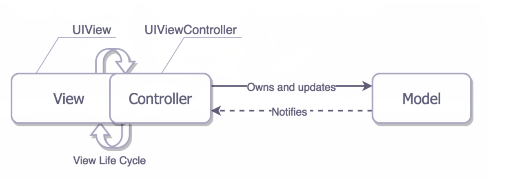


### 题目还原

**介绍下 `MVC`, `MVP`, `MVVM`**


#### MV(X)

* Models - 存放业务数据或者处理数据相关的数据访问层。例如 ‘Person’ 或者 ‘PersonDataProvider’ 类。
* Views - 存放展示层（GUI），在iOS中，前缀是UI的。
* Controller/Presenter/ViewModel  -  模型和视图之间的胶水或者媒介，一般来说，通过用户在视图上的事件触发改变模型，以及模型的更新反映到用户视图上。
 
#### MVC

* 分布 - View 和 Model 实际上是分离的，但是View和Controller却耦合太深。
* 可测试性 - 因为耦合性太深，你只能测试你的Model。
* 易用性 - 对比其他模式代码最少。 除此之外，开发者相对比较熟悉它，同时它也方便给那些经验不足的开发者维护。

#### MVP

* 分布 -  我们大部分责任都在分类 Presenter和Model，以及一个非常轻量的View。
* 可测试性 -  非常棒，因为视图的轻量级别，我们可以很方便的测试大部分逻辑。
* 易用性 - 代码量是MVC的双倍，同时，MVP的目的是非常清晰的。

#### MVVM

* 分布 - MVVM的View相对于MVP的View有着更多的责任。因为前者是通过设置绑定，从View Model中来更新状态，后者是将所有事件传递给Presenter，并不更新自身。
* 可测性 -  View Model与View没有任何联系，这个允许我们很方便的测试。View或许也是可以测试，但是因为依赖UIKit，我们往往会跳过它。
* 易用性 - 代码量和我们之前的MVP模式例子大致相同，但是在实际应用中，你必须要从View传递所有事件给Presenter和手动更新View，MVVM显得更加精简，如果使用绑定的话。

#### 参考链接
https://medium.com/ios-os-x-development/ios-architecture-patterns-ecba4c38de52#.67bu0gn15
